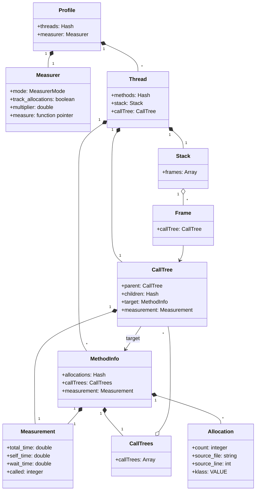

# Architecture

## Overview

ruby-prof is a C extension that uses Ruby's [TracePoint](https://docs.ruby-lang.org/en/master/TracePoint.html) API to intercept method calls and returns. Every time a method is entered or exited, ruby-prof records timing and (optionally) allocation data. This tracing approach means ruby-prof captures every method invocation, giving exact call counts and complete call graphs.

The diagram below shows the main classes that make up ruby-prof:



## Profile

Profile is the top-level object returned by a profiling run:

```ruby
profile = RubyProf::Profile.profile do
  ...
end
```

A Profile owns a Measurer that determines what is being measured, and a collection of Threads representing each thread (or fiber) that was active during profiling.

## Measurer and Measurement

The **Measurer** controls what ruby-prof measures. It holds a function pointer that is called on every method entry and exit to take a measurement. The three modes are:

- **Wall time** — elapsed real time
- **Process time** — CPU time consumed by the process (excludes time spent in sleep or I/O)
- **Allocations** — number of objects allocated

Each CallTree and MethodInfo holds a **Measurement** that accumulates the results: total time, self time (excluding children), wait time (time spent waiting on other threads), and call count.

## Thread

Each Thread tracks the methods called on that thread and owns the root of a call tree. It also maintains an internal Stack of Frames used during profiling to track the current call depth.

**Stack** and **Frame** are transient — they exist only while profiling is active. A Frame records timing data for a single method invocation on the stack, including start time and time spent in child calls. When a method returns, its Frame is popped and the accumulated timing is transferred to the corresponding CallTree node.

## CallTree and MethodInfo

These two classes are central to ruby-prof and represent two different views of the same profiling data:

- **CallTree** records the calling structure — which method called which, forming a graph. Each node has a parent, children, and a reference to its target MethodInfo. A method that is called from two different call sites will have two separate CallTree nodes, each with its own Measurement. Recursive methods create cycles in the graph.

- **MethodInfo** represents a single method regardless of where it was called from. It aggregates data across all call sites. Each MethodInfo holds a CallTrees collection that links back to every CallTree node that invoked that method, providing both caller and callee information.

This separation is what allows ruby-prof to generate both call graph reports (which show calling relationships) and flat reports (which show per-method totals).

## Allocation

When allocation tracking is enabled, each MethodInfo records the objects it allocated. An Allocation tracks the class of object created, the source location, and the count.

## Memory Management

The Profile object is responsible for managing the memory of its child objects, which are C structures. When a Profile is garbage collected, it recursively frees all its objects. In the class diagram, composition relationships (filled diamond) indicate ownership — a Profile frees its Threads, Threads free their CallTrees and MethodInfo instances, and so on.

ruby-prof keeps a Profile alive as long as there are live references to any of its MethodInfo or CallTree objects. This is done via Ruby's GC mark phase: CallTree instances mark their associated MethodInfo, and MethodInfo instances mark their owning Profile.

Starting with version 1.5, it is possible to create Thread, CallTree and MethodInfo instances from Ruby (this was added to support testing). These Ruby-created objects are owned by Ruby's garbage collector rather than the C extension. An internal ownership flag on each instance tracks who is responsible for freeing it.
