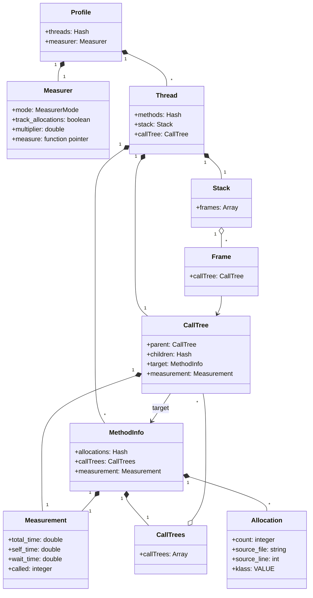
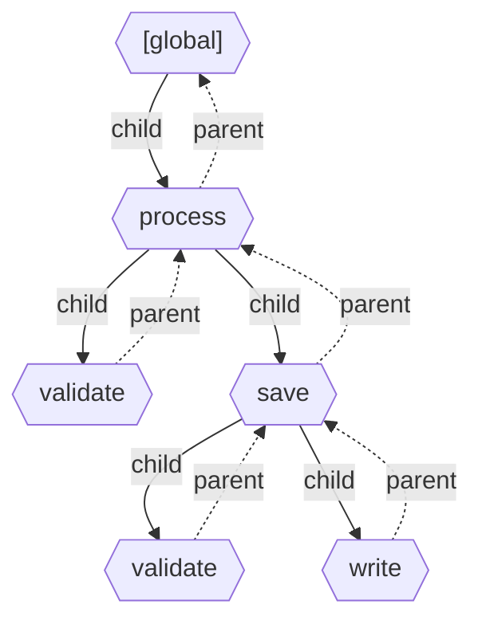
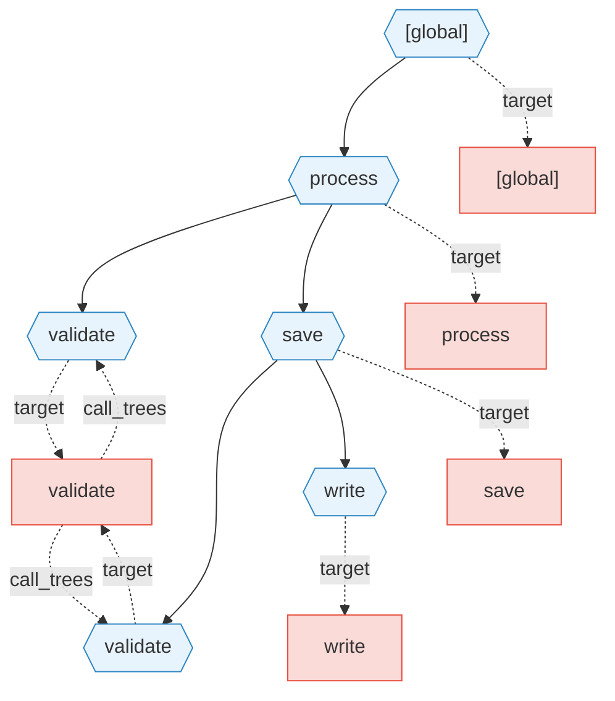
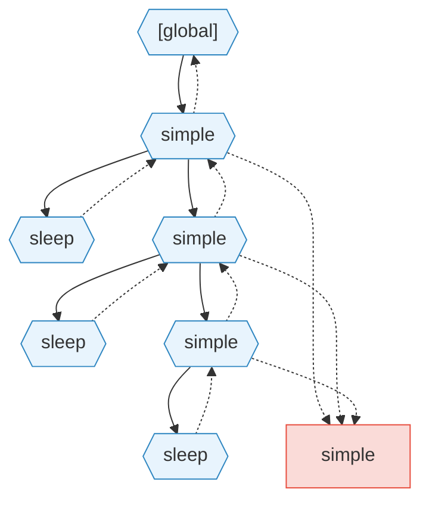
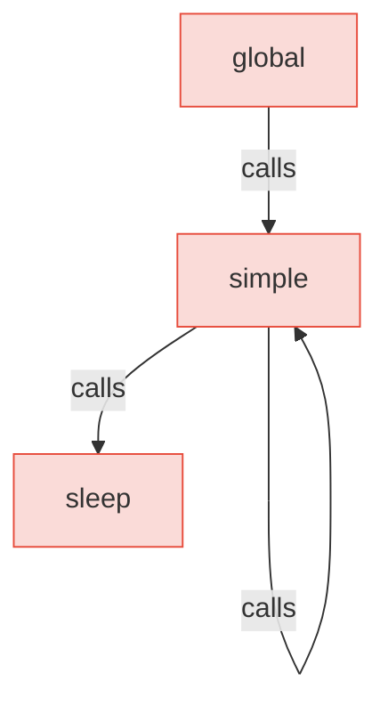

# Architecture

## Overview

ruby-prof is a C extension that uses Ruby's [TracePoint](https://docs.ruby-lang.org/en/master/TracePoint.html) API to intercept method calls and returns. Every time a method is entered or exited, ruby-prof records timing and (optionally) allocation data. This tracing approach means ruby-prof captures every method invocation, giving exact call counts and complete call graphs.

The diagram below shows the main classes that make up ruby-prof:


```mermaid
classDiagram
    Profile "1" *-- "1" Measurer
    Profile "1" *-- "*" Thread
    Thread "1" *-- "1" Stack
    Thread "1" *-- "*" MethodInfo
    Thread "1" *-- "1" CallTree
    Stack "1" o-- "*" Frame
    Frame --> CallTree
    CallTree "1" *-- "1" Measurement
    CallTree --> MethodInfo : target
    MethodInfo "1" *-- "1" CallTrees
    MethodInfo "1" *-- "1" Measurement
    MethodInfo "1" *-- "*" Allocation
    CallTrees o-- "*" CallTree

    class Profile {
        +threads: Hash
        +measurer: Measurer
    }
    class Measurer {
        +mode: MeasurerMode
        +track_allocations: boolean
        +multiplier: double
        +measure: function pointer
    }
    class Thread {
        +methods: Hash
        +stack: Stack
        +callTree: CallTree
    }
    class Stack {
        +frames: Array
    }
    class Frame {
        +callTree: CallTree
    }
    class CallTree {
        +parent: CallTree
        +children: Hash
        +target: MethodInfo
        +measurement: Measurement
    }
    class MethodInfo {
        +allocations: Hash
        +callTrees: CallTrees
        +measurement: Measurement
    }
    class Measurement {
        +total_time: double
        +self_time: double
        +wait_time: double
        +called: integer
    }
    class Allocation {
        +count: integer
        +source_file: string
        +source_line: int
        +klass: VALUE
    }
    class CallTrees {
        +callTrees: Array
    }
```

## Profile

Profile is the top-level object returned by a profiling run:

```ruby
profile = RubyProf::Profile.profile do
  ...
end
```

A Profile owns a Measurer that determines what is being measured, and a collection of Threads representing each thread (or fiber) that was active during profiling.

## Measurer and Measurement

The **Measurer** controls what ruby-prof measures. It holds a function pointer that is called on every method entry and exit to take a measurement. The three modes are:

- **Wall time** — elapsed real time
- **Process time** — CPU time consumed by the process (excludes time spent in sleep or I/O)
- **Allocations** — number of objects allocated

Each CallTree and MethodInfo holds a **Measurement** that accumulates the results: total time, self time (excluding children), wait time (time spent waiting on other threads), and call count.

## Thread

Each Thread tracks the methods called on that thread and owns the root of a call tree. It also maintains an internal Stack of Frames used during profiling to track the current call depth.

**Stack** and **Frame** are transient — they exist only while profiling is active. A Frame records timing data for a single method invocation on the stack, including start time and time spent in child calls. When a method returns, its Frame is popped and the accumulated timing is transferred to the corresponding CallTree node.

## CallTree and MethodInfo

These two classes are central to ruby-prof and represent two different views of the same profiling data:

- **CallTree** records the calling structure — which method called which, forming a tree. Each node has a parent, children, and a reference to its target MethodInfo. A method that is called from two different call sites will have two separate CallTree nodes, each with its own Measurement. Recursive methods are handled by creating a chain of CallTree nodes (see [Recursion](#recursion) below).

- **MethodInfo** represents a single method regardless of where it was called from. It aggregates data across all call sites. Each MethodInfo holds a CallTrees collection that links back to every CallTree node that invoked that method, providing both caller and callee information.

This separation is what allows ruby-prof to generate both call graph reports (which show calling relationships) and flat reports (which show per-method totals).

## Building the Call Tree

This section describes how the call tree is constructed during profiling.

Consider profiling this code:

```ruby
def process
  validate
  save
end

def save
  validate
  write
end
```

The resulting CallTree looks like:


```mermaid
graph TD
    A{{"[global]"}} -->|child| B{{"process"}}
    B -->|child| C{{"validate"}}
    B -->|child| D{{"save"}}
    D -->|child| E{{"validate"}}
    D -->|child| F{{"write"}}

    B -.->|parent| A
    C -.->|parent| B
    D -.->|parent| B
    E -.->|parent| D
    F -.->|parent| D
```

Notice that `validate` appears as two separate CallTree nodes — one under `process` and one under `save` — because it was called from two different call sites. Each has its own parent and its own Measurement. Both nodes reference the same `validate` MethodInfo, which aggregates the data across both call sites.

The following diagram shows both views together. CallTree nodes (hexagons) reference their target MethodInfo (rectangles) via dashed arrows:


```mermaid
graph TD
    classDef calltree fill:#E8F4FD,stroke:#2E86C1
    classDef methodinfo fill:#FADBD8,stroke:#E74C3C

    CT1{{"[global]"}}:::calltree --> CT2{{"process"}}:::calltree
    CT2 --> CT3{{"validate"}}:::calltree
    CT2 --> CT4{{"save"}}:::calltree
    CT4 --> CT5{{"validate"}}:::calltree
    CT4 --> CT6{{"write"}}:::calltree

    CT1 -.->|target| M1["[global]"]:::methodinfo
    CT2 -.->|target| M2["process"]:::methodinfo
    CT3 -.->|target| M3["validate"]:::methodinfo
    CT4 -.->|target| M4["save"]:::methodinfo
    CT5 -.->|target| M3
    CT6 -.->|target| M5["write"]:::methodinfo

    M3 -.->|call_trees| CT3
    M3 -.->|call_trees| CT5
```

Both `validate` CallTree nodes point to the same `validate` MethodInfo via `target`. The MethodInfo points back to its CallTree nodes via `call_trees` — a flat array of every CallTree node that invoked this method. From this array, `callers` and `callees` are derived: `callers` walks each node's parent, and `callees` walks each node's children. Both are aggregated by method to produce a single entry per caller or callee method.

### Parents

Each CallTree node has exactly one parent, set at creation. When a method call event fires, the profiler determines the parent from the current frame on the stack:

```c
parent_call_tree = frame->call_tree;
```

The parent is the CallTree node that was active (top of the stack) when this method was called. The root CallTree node for each thread has no parent.

### Children

A CallTree node's children are stored in a hash table keyed by method. The profiler looks up the method in the current parent's children. If a child already exists for that method, the existing CallTree node is **reused** and its `called` count increments. Otherwise a new node is created:

```c
call_tree = call_tree_table_lookup(parent_call_tree->children, method->key);

if (!call_tree)
{
    call_tree = prof_call_tree_create(method, parent_call_tree, ...);
    prof_call_tree_add_child(parent_call_tree, call_tree);
}
```

This means each parent has **one** child CallTree per method. For example, if `foo` calls `bar` ten times, there is a single `bar` CallTree node under `foo` with `called: 10`.

## Allocation

When allocation tracking is enabled, each MethodInfo records the objects it allocated. An Allocation tracks the class of object created, the source location, and the count.

## Memory Management

The Profile object is responsible for managing the memory of its child objects, which are C structures. When a Profile is garbage collected, it recursively frees all its objects. In the class diagram, composition relationships (filled diamond) indicate ownership — a Profile frees its Threads, Threads free their CallTrees and MethodInfo instances, and so on.

ruby-prof keeps a Profile alive as long as there are live references to any of its MethodInfo or CallTree objects. This is done via Ruby's GC mark phase: CallTree instances mark their associated MethodInfo, and MethodInfo instances mark their owning Profile.

Starting with version 1.5, it is possible to create Thread, CallTree and MethodInfo instances from Ruby (this was added to support testing). These Ruby-created objects are owned by Ruby's garbage collector rather than the C extension. An internal ownership flag on each instance tracks who is responsible for freeing it.

## Recursion

The call tree handles recursion naturally — each recursive call has a different parent, so new nodes are created at each level just like any other method call. The only special handling is in timing calculation, where care is needed to avoid double-counting.

### How Recursive Calls Create New Nodes

Consider a simple recursive method:

```ruby
def simple(n)
  sleep(1)
  return if n == 0
  simple(n - 1)
end

simple(2)
```

Each recursive call to `simple` has a different parent CallTree node, so the lookup in the parent's children misses and a new node is created at each level:


```mermaid
graph TD
    classDef calltree fill:#E8F4FD,stroke:#2E86C1
    classDef methodinfo fill:#FADBD8,stroke:#E74C3C

    A{{"[global]"}}:::calltree --> B{{"simple"}}:::calltree
    B --> C{{"sleep"}}:::calltree
    B --> D{{"simple"}}:::calltree
    D --> E{{"sleep"}}:::calltree
    D --> F{{"simple"}}:::calltree
    F --> G{{"sleep"}}:::calltree

    B -.-> A
    C -.-> B
    D -.-> B
    E -.-> D
    F -.-> D
    G -.-> F

    B -.-> M["simple"]:::methodinfo
    D -.-> M
    F -.-> M
```

The CallTree is always acyclic — each recursive call creates a new node at a deeper level. However, there is a single `simple` MethodInfo (red rectangle at the bottom of the diagram), and each CallTree node points to it.

### The Visits Counter

Both CallTree and MethodInfo have a `visits` field that tracks how many times that node or method is currently on the stack. This counter is incremented on method entry and decremented on method exit:

```c
// Method entry (prof_frame_push):
call_tree->visits++;
if (call_tree->method->visits > 0)
    call_tree->method->recursive = true;
call_tree->method->visits++;

// Method exit (prof_frame_pop):
call_tree->visits--;
call_tree->method->visits--;
```

The MethodInfo `visits` counter serves two purposes:

1. Detecting recursion — if `method->visits > 0` when a method is entered, the method is currently an ancestor of itself in the call stack and is marked recursive.

2. Correct total_time accounting — total time is only added to the Measurement when a node's `visits` drops back to 1, meaning it is the outermost invocation:

```c
// Only accumulate total_time at the outermost visit
if (call_tree->visits == 1)
    call_tree->measurement->total_time += total_time;

if (call_tree->method->visits == 1)
    call_tree->method->measurement->total_time += total_time;
```

Without this guard, total time would be double-counted. Consider `simple(2)` with 1-second sleeps. The outermost call takes ~3 seconds total, the middle call ~2 seconds, and the innermost ~1 second. Naively summing all three would give 6 seconds, but the actual elapsed time is only 3 seconds. By only recording total_time at the outermost visit, the MethodInfo correctly reports 3 seconds.

### Recursion at the MethodInfo Level

At the MethodInfo level, recursive methods create cycles. A recursive `simple` method has itself as both a caller and a callee:


```mermaid
graph TD
    classDef methodinfo fill:#FADBD8,stroke:#E74C3C
    A["global"]:::methodinfo -->|"calls"| B["simple"]:::methodinfo
    B -->|"calls"| C["sleep"]:::methodinfo
    B -->|"calls"| B
```

This is why MethodInfo has a `recursive?` flag — printers that operate on MethodInfo (such as the graph printer) need to be aware of these cycles. However, the underlying CallTree structure is always a tree with no structural cycles.
